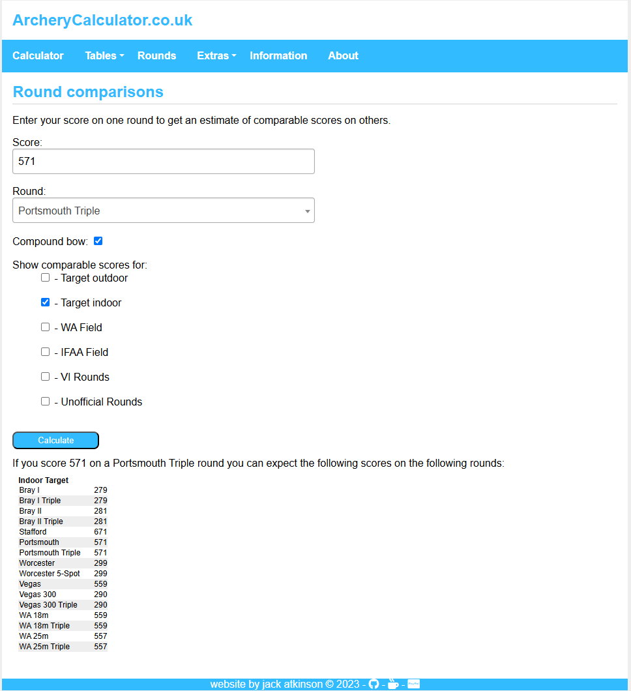

## Classifications and Classification Tables

Archery GB have recently made the decision to lock the classification tables behind Sport80, meaning you now have to sign in to your Sport80 account to view them. If you're interested in seeing what your classification would be, they’re available in the 'Member Resources' section of the [Archery GB Dashboard](https://archerygb.org/dashboard/process.php?sso2).

Alternatively, a more mobile-friendly version can be found on the [ArcheryGeekery website](https://archerygeekery.co.uk/mobile-friendly-classification-tables/), which is probably easier for checking your scores at shoots.

I’ll also usually have a printed copy of the classification tables in my bag if you ever need to check something with me.

If you’d like more information on what classifications even are, you can check out [this webpage](https://archerygeekery.co.uk/2023/04/07/how-to-be-an-archery-club-records-officer-part-4-outdoor-classifications/) or send me a message `:)`.

## Handicaps

Another topic to touch on is handicaps. 

### What are handicaps used for?

#### Levelling the playing field between archers

> "When archers of diffreent skill levels or bow types are shooting together, it normally wouldn’t be possible for them to compete meaningfully against each other. However, we can use each archer’s handicap to adjust their scores to mathematically level the playing field."

> "This is done using the [handicap allowance tables](https://archerygeekery.co.uk/hc/generateCustomHandicapTables.php) which look just like the handicap tables, but instead give a number of “bonus” points that an archer of a particular handicap is given on a particular round."

> "The allowance tables are created such that if you shoot as well as your handicap would suggest you would, then your score plus your allowance would be 1,440 points. If it comes out higher than that then you’re shooting better than your handicap would predict, and if it’s lower, then you’re not having as good a day as you normally do."

#### Comparing between rounds

> "If you only ever shoot the same round over and over again, it’s easy to track your progress, but if you shoot lots of different rounds, how do you really know if you shot as well as you normally did or not?"

> "By comparing the handicaps of your scores rather than the scores themselves, you can see which score is actually better, because it will have a lower handicap."

#### Tracking Progress

> "Your handicap is quite a sensitive measure of your skill level, and so you can use it to track your progress over time."

For example, here are the handicaps of all of the scores I shot across the 2024 Outdoor season.

And here are the handicaps of all of the scores I have shot so far in the 2024/2025 Indoor season.

### Handicap Resources and Maths

Some of the webpages linked are a bit mathsy, but you don’t need to understand all the details to get the idea of why handicaps are used and how they’re useful in archery.

They’re all interesting reads if you’ve got time and enjoy data.

- [Beginner’s Series: Part 2 – Handicaps](https://archerygeekery.co.uk/2023/06/13/beginners-series-handicaps/)
- [Overview of the New Indoor Handicap and Classification Systems](https://archerygeekery.co.uk/2023/09/12/overview-of-the-new-indoor-handicap-and-classification-systems/)
- [Handicap System Maths](https://archerygeekery.co.uk/2024/12/02/handicap-system-maths/)
- [How to be an Archery Club Records Officer: Part 3 – Handicaps](https://archerygeekery.co.uk/2023/04/04/how-to-be-an-archery-club-records-officer-part-3-handicaps/)
- [The Archery Handicap System by Jack Atkinson (author of the current handicap system)](https://jackatkinson.net/post/archery_handicap/)

### 'The Archery Handicap System by Jack Atkinson', Summary

> "There will be some slight variation in technique from shot to shot, and variation of the point of release as the sight floats during the aiming process. As a result each arrow will follow a slightly different path to the target, spread around the perfect trajectory illustrated above."
>
> "The spread of these arrows can be described by an angle that contains all of the trajectories at the point at which they leave the bow. This is shown by the blue triangle in the above image, with the angle labelled ‘x’. The smaller this angle, the tighter the group will be at the target. *At the most fundamental level, this angle is the archer’s handicap.*"

> "Shots described by a normal distribution."

> "Arrow distributions of a high handicap (low skill) archer (left) and low handicap (high skill) archer."

> "So at its most simple level, your handicap tells you the standard deviation of the angle at which you shoot your arrows from the bow."
>
> "The scheme ranges from a handicap of 100, which is an angle of 1.55 degrees, to a handicap of 0 which is an angle of 0.045 degrees. For reference, an angle of 0.5 degrees would give a group the size of the boss at 70m and corresponds to a handicap of 68."

## Indoor Rounds

Here are some resources explaining UK Indoor Rounds in more detail.

The one most people know is the Portsmouth round, which we shot at our SWWU Leg last month. It’s 60 arrows on a 60cm target face from 20 yards. This is also the round for BUCS Indoor Qualifiers next month, so it’s worth practising in the meantime

The other common indoor rounds we might tend to shoot indoors are WA 18m, Bray I, Vegas 300, and Worcester rounds.

- [UK Indoor Archery Rounds – The Finer Details](https://archerygeekery.co.uk/2024/02/17/uk-indoor-archery-rounds-the-finer-details/)

I'm not going to explain outdoor rounds in this document because we don't get much opportunity to shoot them here at the club anyways, but information can be easily found online if you're interested.

## Archery Calculator

Finally, another useful web tool to look at is Archery Calculator. 

You can use it to enter your score details to see the classification and handicap that your score would give you, or use the Round Comparison feature to see how your scores "translate" across different rounds, for example you could see how you would hypothetically do if you suddenly shot a WA 1440 (90m) (not recommended), or how your Portsmouth score would "translate" across to a WA 18m.

- [Archery Calculator](https://archerycalculator.co.uk/)
- [Round Comparison Tool](https://archerycalculator.co.uk/extras/roundscomparison/)

## Shooting Record Cards

Reminder to add any scores you shoot - at club practice sessions or at competitions - into your Shooting Record Card if you have one, and then pass this back to me at the end of each month so I can add these scores to my spreadsheet and work out your classification level and handicap. 

If you want a Shooting Record Card but don't have one yet then you can fill out the Records Information Survey that I've sent out in the past and I'll give you a card whenever I'm next able to print more of them...

---

Any questions about Rounds or Classifications then just let me know `:)`

Thanks,  
Corey (Records Officer)